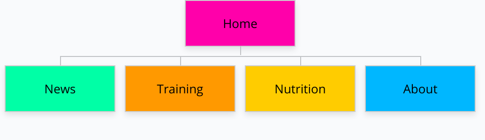
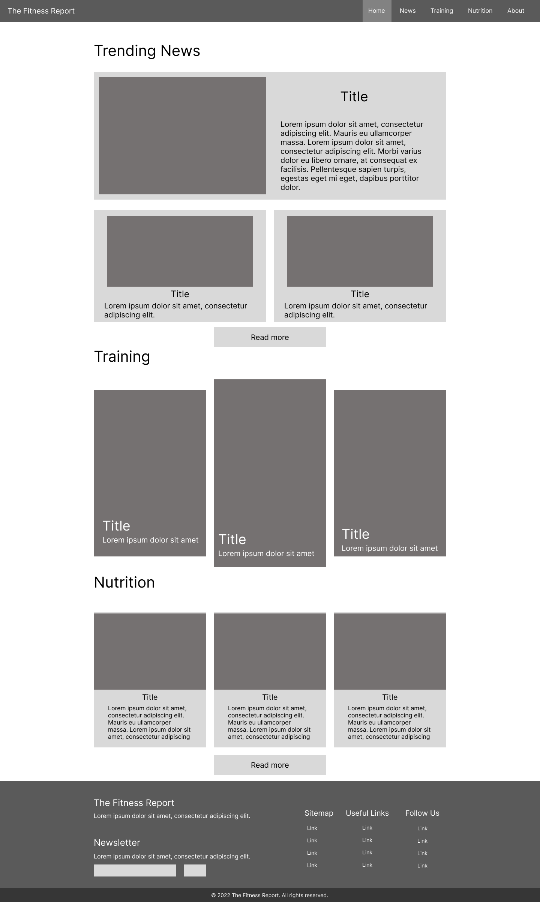
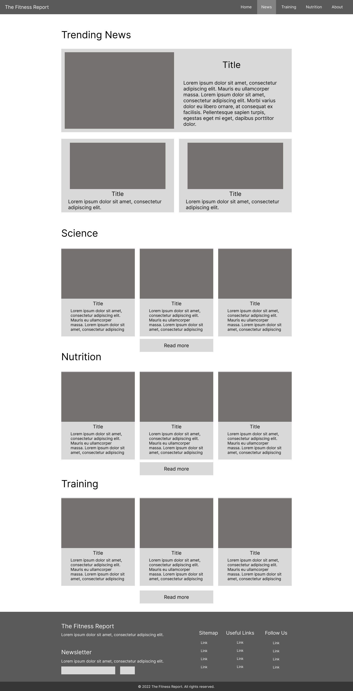
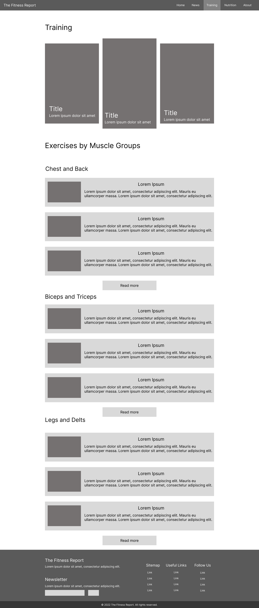
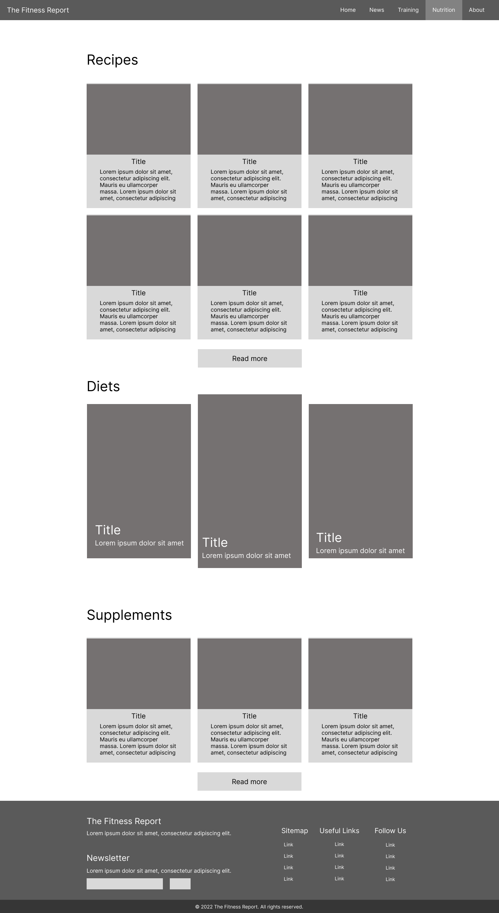
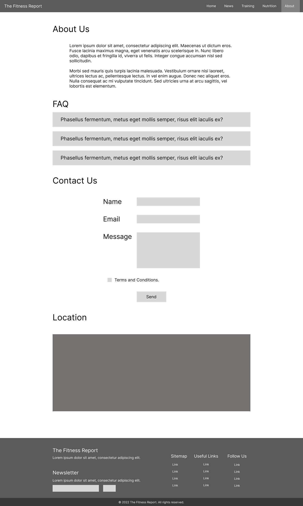

<!-- Table of Contents -->

# Introduction

## Purpose

What is the essential story begin told by your website?

My website's objective is to offer a wide range of articles about fitness, going from basic exercises for different muscle groups to recipies for best nutrition, to science based information about our body and how it works.

The target audience is absolutely anyone, from novice to experienced lifters. I believe that every person should work out and live a proper life.

From my experience I want everybody to have a chance and a starting point in lifting.

## Structure

What type of structure did you choose to implement?

The "Home" page features a little bit of information from every other page, sort of like an introduction to other sections of the website. Just like an online magazine would do, the first section features trending news that are most engaged by our readers. then a section about training which shows the types of exercises someone could do to either build muscle or lose weight. last section presents latest recipes for the nustrition category.

The "News" page feaures the same section of trending news and then articles grouped by their specific category like scinece, nutrition training. Every section containes the latest 3 articles for that category and a button with the option to load more.

The "Trainig" page shows a bunch of exercises grouopd by muscle groups. Each section shows the best exercises that would work these muscles.

The nustrition page features recipes, information about diets and supplements .

in the about page the user will find info about the website, some frequesti asked questi a contact form and the location of the headquarters of the magazine.

# Inspiration

1. my experiece

2. some website myfitnesspal or bodybuilding

3. some influencer

# Accessibility

1. 

2. 

3. 

# Usability

1. spaced out

2. big things

3. colors

# Learning

1. CSS flexbox and CSS grid 

2. 

3. 

# Evaluation

## Evaluation I

## Evaluation II

# Resources

MDN Web Docs - The MDN Web Docs site provides information about Open Web technologies including HTML, CSS, and APIs for both Web sites and progressive web apps.

W3Schools Online Web Tutorials - W3Schools is an educational website for learning web technologies online.

Figma - Figma is a browser-based collaborative interface design tool

(WebDev Simplified / Kevin Powels)YouTube - 

Visual Studio Code - Visual Studio Code is a code editor redefined and optimized for building and debugging modern web and cloud applications

W3C Markup Validation Service  - This validator checks the markup validity of Web documents in HTML, XHTML, SMIL, MathML, etc.

bodybuilding.com
myfitness pal
healthnews

## References

[1]  

...

# Appendices

## Sitemap

## Wireframes

### Desktop

### Mobile

## Mockups